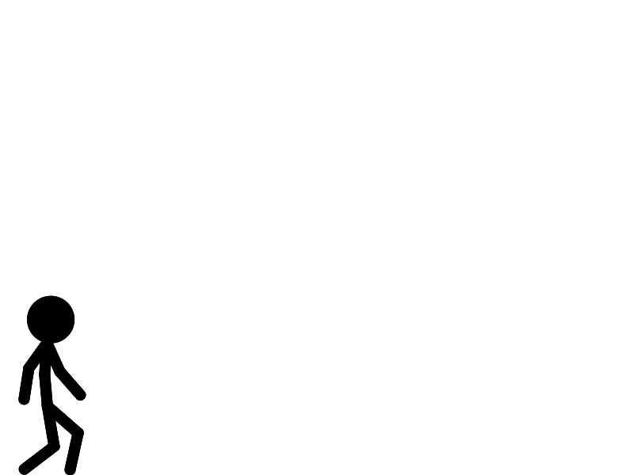

# 2D Animation Package with Inverse Kinematics

A Java desktop stick-figure animation editor designed to make inverse kinematics (IK) the simplest way to pose a limb.

Drag an end-effector at a character’s hand or foot and the corresponding two-segment limb follows. The application supports keyframed animation, independent figure layers, onion skinning, easing, playback, JSON-backed project files, and media export.

Built as a third-year individual project during my integrated MEng Computer Science degree at the University of Southampton.




## Project overview

Many beginner-friendly stick-figure animation tools use Forward Kinematics, requiring users to position each joint individually. More feature-rich animation tools provide advanced rigging and IK workflows, but can introduce a steeper learning curve.

This project explores a lower-friction alternative: a pre-built stick-figure skeleton with IK available immediately for whole-limb posing. Users do not need to construct or configure a rig before creating animations.

The project focuses on improving the accessibility of existing animation techniques rather than introducing a new IK algorithm.

## Features

* **IK posing**: drag visible hand and foot end-effectors; the FABRIK solver adjusts the corresponding two-segment limb
* **Keyframing**: add, remove, and reposition keyframes on the timeline
* **Interpolation**: explicitly create interpolation segments between surrounding keyframes
* **Easing**: Linear, Ease-In Quad, Ease-Out Quad, and Ease-In-Out Quad
* **Per-figure timeline layers**: animate multiple figure instances independently
* **Onion skinning**: configurable past and future pose overlays
* **Real-time playback**: playback at the project frame rate
* **Project settings**: adjustable frame rate and maximum animation length
* **Save/load**: indented JSON-based `.stickanim` project files
* **Autosave**: periodic autosaving after the project has been saved or loaded once
* **Export**: current-frame PNG, PNG image sequence, animated GIF, and MP4 video

## Technology stack

* **Java 8**
* **JavaFX**, with the interface built programmatically using JavaFX controls and `Canvas` rendering
* **Maven** for compilation, dependency management, and packaging
* **Jackson Databind** for JSON serialisation and deserialisation
* **JavaCV and FFmpeg** for MP4 encoding
* **ImageIO** for PNG and animated GIF generation
* **Log4j 2** for application logging

## Architecture

The application uses an MVC-style structure to separate user interaction, interface rendering, and animation state.

* **Model**: figure data, constraints, IK chains, timeline state, interpolation, persistence, and export logic
* **View**: JavaFX scenes, canvas rendering, timeline cells, menus, and export dialogs
* **Controllers and communication**: handle user input and use the `AnimationUpdateListener` callback interface to receive model updates and refresh the views

The figure system uses definitions, segments, constraints, and IK-chain metadata to create runtime stick-figure models. Multiple instances of the predefined figure can be added to a project, each with its own timeline row.

## Technical highlights

### FABRIK inverse kinematics

The project implements the Forward And Backward Reaching Inverse Kinematics algorithm for the two-segment arms and legs.

During a drag:

1. The solver checks whether the target is reachable.
2. It performs a backward pass from the target towards the fixed base.
3. It performs a forward pass while restoring the base position.
4. It repeats until the end-effector is within tolerance or the iteration limit is reached.
5. Additional constraints are applied to preserve relationships outside the active IK chain.

FABRIK was selected because its iterative point-repositioning approach is relatively simple and computationally inexpensive for responsive real-time interaction.

### Angle-aware interpolation

Each keyframe stores both point positions and limb angles.

During interpolation, general pose data is interpolated between keyframes, while the angles of IK chains are interpolated along their shortest angular path. The limbs are then reconstructed from those angles, preserving their segment lengths during playback instead of repeatedly solving IK for every interpolated frame.

### Timeline-based animation

The timeline stores keyframes and interpolation segments independently for each figure. Users can move keyframes, select different easing functions per interpolation segment, preview interpolated poses, and control multiple figure instances within the same project.

## Testing and evaluation

Testing was primarily manual and is documented in the accompanying project report. It included:

* Incremental white-box testing during development
* Logging and debugger-assisted investigation
* Manual requirements-based black-box verification
* Testing of IK posing, playback, interpolation, saving, loading, and export

The report also documents a qualitative comparison with Pivot Animator. Three participants, identified as P1–P3, had no previous animation-software experience and completed basic tasks using both tools.

Participants generally described the IK workflow as easier and more natural for whole-limb posing. Independent timeline rows for separate figures were also positively received.

The evaluation was qualitative rather than a timed performance benchmark. Participants also identified the main limitations: no undo/redo, no custom figure editor, and less direct control for precise isolated joint rotations.

## Known limitations

* **No undo/redo**: accidental edits cannot currently be reverted through an edit history
* **One predefined figure design**: multiple instances can be added, but users cannot create or modify custom skeletons through the interface
* **Limited interpolation control**: interpolation uses four preset easing functions and has no visual path or Bézier editor
* **No physics system**: gravity, collisions, momentum, and other physics-based effects were outside the implemented scope
* **Fixed export controls**: output uses the current canvas dimensions and project frame rate; resolution and quality settings are not exposed
* **Fixed interface styling**: there are no user-configurable themes or font settings
* **2D-only workspace**: no 3D camera or alternative viewing perspective is provided

## Future work

The project report identified the following potential improvements:

* Undo/redo support
* A custom figure and skeleton editor
* Visual interpolation and Bézier-curve controls
* Larger point-selection hitboxes and further interface refinements
* Timeline thumbnails and optional keyframe auto-advance
* Configurable export resolution and quality
* Optional physics-based effects such as gravity and collisions

## Running locally

The current build targets Java 8 and uses a Windows-specific FFmpeg dependency for MP4 export.

### Requirements

* Maven 3.6+
* A JDK 8 distribution that includes JavaFX, such as Oracle JDK 8 or Azul Zulu 8 FX
* Windows is recommended for the current MP4 configuration

JavaFX is not declared as a Maven dependency in this version of the project, so a standard OpenJDK or Temurin installation without JavaFX will not run it as configured.

### Build and run

```bash
git clone https://github.com/AshhProjects/2D-IK-Animation-Package.git
cd 2D-IK-Animation-Package

mvn clean package -Pshade
java -jar target/stick-animator-1.0-SNAPSHOT-shaded.jar
```

The `shade` profile is required to produce the dependency-bundled JAR. JavaFX must still be available from the installed JDK.

## Project report

The [full project report](docs/Report.pdf) covers the background research, systematic review of existing animation tools, requirements analysis, architecture, implementation, testing, evaluation, and future work.

## Acknowledgements

* Aristidou, A. and Lasenby, J. (2011). *FABRIK: A Fast, Iterative Solver for the Inverse Kinematics Problem*. Graphical Models, 73(5). [DOI](https://doi.org/10.1016/j.gmod.2011.05.003)
* `GifSequenceWriter` was adapted from [Elliot Kroo’s Stack Overflow implementation](https://stackoverflow.com/questions/16649620/is-there-a-way-to-create-one-gif-image-from-multiple-images-in-java/16649681), with attribution and licensing information preserved in the source code.
* Supervised by David Millard, University of Southampton

## Author

**Ash-Hab Abbasi**
MEng Computer Science, University of Southampton, First Class Honours

[LinkedIn](https://www.linkedin.com/in/ash-hab-abbasi-9b10a4153/) · [ashhab.abbasi04@gmail.com](mailto:ashhab.abbasi04@gmail.com)
